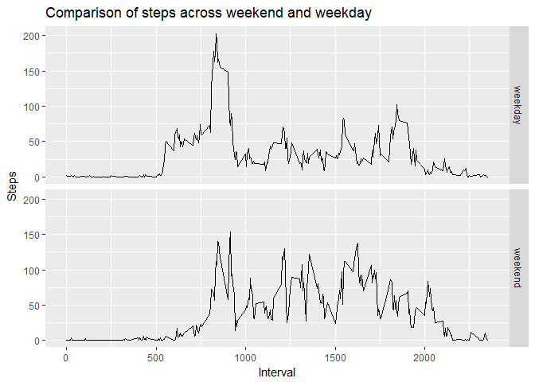

## Loading and preprocessing the data

The activity dataset is *.csv format and will be read in using the read.csv function.
At this stage, the only pre-processing required is to specify a date format for the date column.
We will also load the required packages at this point.


```r
setwd("C:/Data Science study/Projects/activitytracking2")
options(scipen = 1, digits = 2)
library(ggplot2)

activity<- read.csv("activity.csv")
activity$date<- as.Date(activity$date, "%Y-%m-%d")
```


## What is mean total number of steps taken per day?

A histogram of the total steps taken per day is displayed below:


```r
# Create a new dataset to calculate the total steps per day
total.steps<- aggregate(steps~date, activity, sum)

# Create a histogram
hist(total.steps$steps, xlab = "Steps", main = "Histogram of total steps taken per day")
```

<!-- -->

```r
# Calculate the mean and median steps per day
mean.steps<- mean(total.steps$steps)
median.steps<- as.numeric(median(total.steps$steps))
```

The mean steps taken per day is 10766.19, and the median steps taken per day is 10765.

## What is the average daily activity pattern?

A time series of the average steps taken per interval is shown below:


```r
# Create a new dataset averaging out the steps across all intervals
interval.steps<- aggregate(steps~interval, activity, mean)

#Plot the average steps
interval.plot<- qplot(interval, steps, data=interval.steps, geom="line") + labs(x="Interval", y="Steps", title="Average steps taken for each interval of time")
interval.plot
```

<!-- -->

```r
#Identify the max value and the corresponding interval
max.step<- max(interval.steps$steps)
max.interval<- interval.steps[interval.steps$steps==max.step, 1]
```

The maximum number of average steps taken in an interval is 206.17, which occurs at interval 835.

## Imputing missing values
Missing values have been replaced with the mean steps for that relevant interval. For example, if the number of steps for interval '1055' is NA for the date '2012-11-24', then the steps for that particular interval have been replaced with the average number of steps for interval '1055'. 

The code for imputing these NA values is below:


```r
# Add the data frame created earlier to the activity data to give the average number of steps for each interval
imputed<- merge(activity, interval.steps, by = "interval", all.x = TRUE)

#Add a new column to this data frame for the new imputed step values
imputed$steps<- ifelse(is.na(imputed$steps.x), imputed$steps.y, imputed$steps.x)
```

A histogram using the imputed values is shown here:


```r
# Create a new dataset to calculate the total steps per day on the imputed data
total.imputed<- aggregate(steps~date, imputed, sum)

# Create a histogram
hist(total.imputed$steps, xlab = "Steps", main = "Histogram of total steps taken per day (imputed)")
```

<!-- -->

```r
# Calculate the mean and median steps per day
imputed.mean<- mean(total.imputed$steps)
imputed.median<- as.numeric(median(total.imputed$steps))
```

With the imputed data, the mean steps per day is 10766.19, and the median steps per day is 10766.19. 

We see the mean and the median have essentially stayed the same.

## Are there differences in activity patterns between weekdays and weekends?

A comparison of the average number of steps taken on a weekday versus a weekend.


```r
#First add a new column to the imputed dataset to specify whether the day is a weekday or weekend.
imputed$day<- ifelse(weekdays(imputed$date) %in% c("Saturday", "Sunday"), "weekend", "weekday")

#Create a new data frame giving the average steps per interval broken down by weekday/weekend
steps<- aggregate(steps~interval+day, imputed, mean)

#Plot the time series of steps over two plots, weekend and weekday
steps.plot<- qplot(interval, steps, data = steps, geom="line", facets = day~.) + labs(x = "Interval", y="Steps", title = "Comparison of steps across weekend and weekday")
steps.plot
```

<!-- -->

We can see that the step pattern on a weekend starts later but remains higher in general than the weekday pattern.
